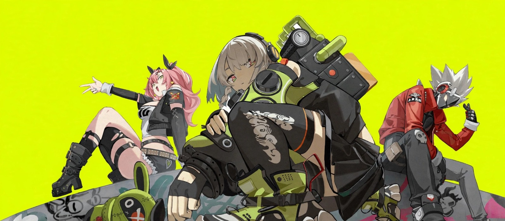
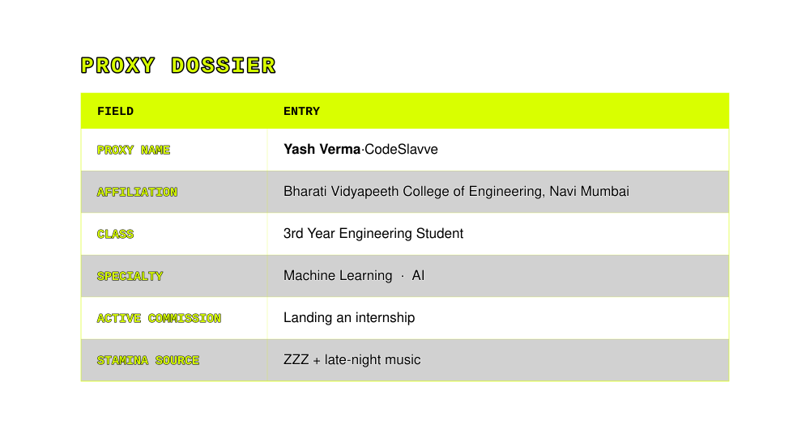
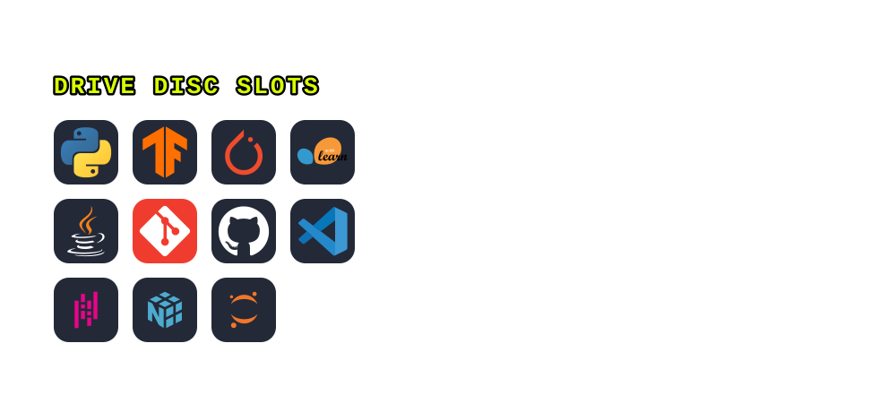
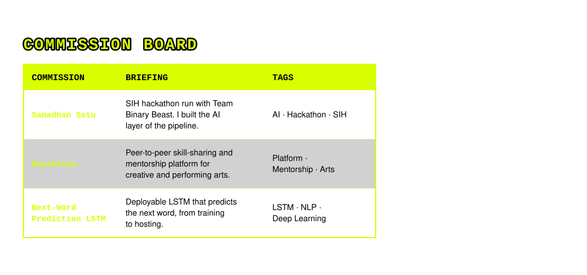

 

  

<table align="center">
<tr>
<td align="center" valign="middle">

</td>
<td valign="middle">
<code>&gt; INCOMING TRANSMISSION</code> 
<code>&gt; FROM: RANDOM PLAY VIDEO STORE</code> 
<code>&gt; MSG: "Welcome, Proxy. The Hollows</code> 
<code>&nbsp;&nbsp;&nbsp;&nbsp;&nbsp;&nbsp;&nbsp;&nbsp;&nbsp;are calling. Bring a repo."</code>
</td>
</tr>
</table>

  

  

  

## 🎭 &nbsp;AGENT ROSTER&nbsp; 🎭

## 📡 &nbsp;COMBAT LOG&nbsp; 📡

## 📞 &nbsp;INTER-KNOT CONTACT&nbsp; 📞

  

  

